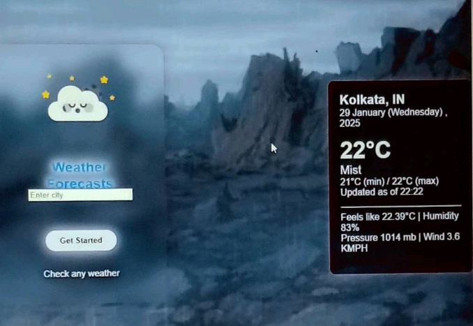
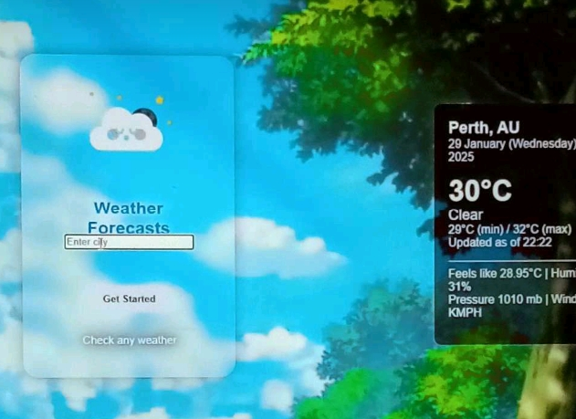

# advance-weather-app

  

An advanced weather web application built with HTML, CSS, and JavaScript that provides detailed and accurate weather information. The app allows users to check the current weather, forecast, and other data for any city worldwide. It integrates multiple data sources to deliver up-to-date weather conditions, including temperature, humidity, wind speed, air quality, and more.

  

Features
Real-time Weather Updates: Displays the current weather conditions, temperature, and humidity.
Forecasting: Shows a 5-day weather forecast with details like temperature, conditions (e.g., sunny, cloudy, rainy), and wind speed.
Air Quality Index: Provides the air quality index (AQI) to inform users about air pollution levels.
Geolocation: Automatically detects the user's location and shows the weather based on that location.
Search by City: Users can search for weather by entering a city name.
Temperature Unit Toggle: Option to switch between Celsius and Fahrenheit.
Interactive Map: View weather data on an interactive map with locations marked.
Responsive Design: Optimized for both desktop and mobile views.

Technologies Used
HTML: Provides the structure and layout of the web application.
CSS: Styling and responsive design for a clean, modern look.
JavaScript: Fetches weather data, handles user input, and dynamically updates the UI.
OpenWeatherMap API: Used to fetch current weather data, forecast information, and more.
Air Quality API: To provide air quality index data.
Leaflet.js: For creating an interactive map to display the weather information visually.
Geolocation API: For detecting and displaying weather based on the user’s current location.
How to Use
Search for Weather: Enter the name of any city in the search bar and press Enter or click the search button.
View Current Weather: The app will display current conditions such as temperature, humidity, wind speed, and air quality.
Check the Forecast: See a 5-day forecast with detailed weather predictions.
Toggle Temperature Unit: Switch between Celsius and Fahrenheit by clicking the temperature unit.
Geolocation: The app will automatically show the weather for your location if you enable geolocation.
Installation
To run the project locally:

Clone the repository:

git clone https://github.com/mohittiwari98/advanced-weather-app.git
Navigate to the project directory:

cd advanced-weather-app
Open index.html in your preferred browser.

No server-side setup is required. This is a client-side application that interacts with weather APIs.

API Key Setup (If Applicable)
If you are using a weather API that requires an API key (e.g., OpenWeatherMap API), follow these steps:

Sign up for an API key at OpenWeatherMap or your preferred weather API provider.

In the JavaScript file (script.js), replace the API_KEY placeholder with your actual API key:

const apiKey = 'YOUR_API_KEY';
Update any relevant URLs in the JavaScript file to ensure they are calling the correct endpoints for your API.

Customization
You can easily modify or add features to the app by editing the following files:

index.html: Modify the layout and content structure of the page.
style.css: Change the appearance of the app, including fonts, colors, and layout adjustments.
script.js: Customize the weather data fetching process, integrate new APIs, or adjust the logic for temperature units and geolocation.
Contributing
Fork the repository.
Create a new branch (git checkout -b feature-xyz).
Make your changes and commit them (git commit -am 'Add new feature').
Push to your branch (git push origin feature-xyz).
Open a pull request to merge your changes.
License
This project is licensed under the MIT License - see the LICENSE file for details.

Acknowledgments
OpenWeatherMap API for providing real-time weather data.
Air Quality API for offering valuable air quality index information.

        
